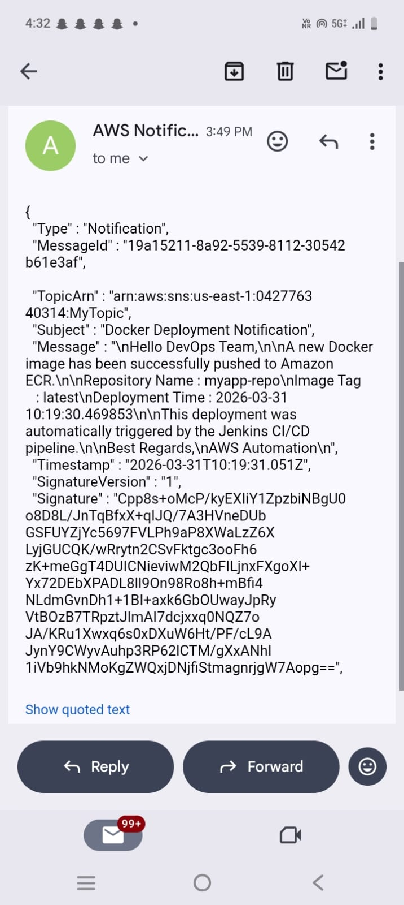

<<<<<<< HEAD
#  Automated Docker Image Deployment to Amazon ECR with Jenkins & Lambda Integration


---

#  Project Overview

This project implements a **CI/CD pipeline** that automatically builds Docker images using **Jenkins**, pushes them to **Amazon Elastic Container Registry (ECR)**, and triggers **AWS Lambda** for post-deployment automation.

The pipeline eliminates manual Docker builds and ensures:

* Automated image building
* Consistent versioning
* Event-driven automation
* Deployment logging
* Email notifications

---

#  Scenario

Your company currently builds Docker images manually and pushes them to Amazon ECR.

This manual workflow causes several problems:

* Version conflicts
* Missed image updates
* No automated post-deployment tasks

To solve this problem, a **CI/CD pipeline using Jenkins and AWS services** was implemented.

---

# 🎯 Objective

Design and implement a CI/CD pipeline where:

* Jenkins builds Docker images automatically
* Images are pushed to Amazon ECR
* AWS Lambda is triggered automatically
* Deployment events are logged and notifications are sent

---

#  Architecture Diagram


```
Developer
   │
   ▼
GitHub Repository
   │
   ▼
Jenkins Pipeline
   │
   ├── Build Docker Image
   ├── Tag Image (Build Number)
   └── Push Image to AWS ECR
            │
            ▼
        Amazon ECR
            │
            ▼
       EventBridge Rule
            │
            ▼
        AWS Lambda
        /        \
       ▼          ▼
   Amazon SNS   DynamoDB
  Email Alerts  Deployment Logs
```

---

#  Technologies & Tools

| Technology      | Purpose                |
| --------------- | ---------------------- |
| Docker          | Containerization       |
| Jenkins         | CI/CD Pipeline         |
| GitHub          | Source Code Management |
| Amazon ECR      | Docker Image Registry  |
| AWS Lambda      | Serverless Automation  |
| Amazon SNS      | Email Notification     |
| Amazon DynamoDB | Deployment Logging     |
| CloudWatch      | Monitoring & Logs      |

---

# 📂 Project Structure

```
docker-ecr-jenkins-lambda
│
├── app.py
├── requirements.txt
├── Dockerfile
├── Jenkinsfile
├── lambda_function.py
└── README.md
```

---

#  Docker Setup

### Dockerfile

```
FROM python:3.9
WORKDIR /app
COPY . .
RUN pip install -r requirements.txt
CMD ["python", "app.py"]
```

### Build Docker Image

```
docker build -t myapp .
```

### Run Container

```
docker run -p 5000:5000 myapp
```

---

# ☁️ Amazon ECR Setup

### Login to ECR

```
aws ecr get-login-password --region us-east-1
docker login --username AWS --password-stdin ACCOUNT_ID.dkr.ecr.us-east-1ws.com
```

### Tag Image

```
docker tag docker-ecr-jenkins-project:latest \
ACCOUNT_ID.dkr.ecr.us-east-1ws.com/myapp:latest
```

### Push Image

```
docker push ACCOUNT_ID.dkr.ecr.ap-south-1.amazonaws.com/docker-ecr-jenkins-project:latest
```

---

# ⚙️ Jenkins Pipeline

The Jenkins pipeline automates the Docker build and deployment process.

### Pipeline Stages

1. Pull code from GitHub
2. Build Docker image
3. Tag image with build number
4. Push image to Amazon ECR

### Jenkinsfile

```
pipeline {
    agent any

    environment {
        AWS_REGION = "us-east-1"
        ACCOUNT_ID = "042776340314"
        ECR_REPO = "myapp"
        IMAGE_TAG = "latest"
    }

    stages {

        stage('Checkout') {
            steps {
                git 'https://github.com/uttamzure/docker-ecr-jenkins-lambda.git'
            }
        }

        stage('Build Docker Image') {
            steps {
                bat 'docker build -t myapp:latest .'
            }
        }

        stage('Login ECR') {
            steps {
                bat "aws ecr get-login-password --region %AWS_REGION% | docker login --username AWS --password-stdin %ACCOUNT_ID%.dkr.ecr.%AWS_REGION%.amazonaws.com"
            }
        }

        stage('Tag Image') {
            steps {
                bat "docker tag myapp:latest %ACCOUNT_ID%.dkr.ecr.%AWS_REGION%.amazonaws.com/%ECR_REPO%:%IMAGE_TAG%"
            }
        }

        stage('Push Image') {
            steps {
                bat "docker push %ACCOUNT_ID%.dkr.ecr.%AWS_REGION%.amazonaws.com/%ECR_REPO%:%IMAGE_TAG%"
            }
        }
    }
}
```

---

#  Lambda Integration

When a Docker image is pushed to ECR, **EventBridge triggers AWS Lambda**.

### Lambda Responsibilities

* Capture repository name
* Capture image tag
* Send SNS notification
* Store deployment logs in DynamoDB

### Lambda Code

```
import json
import boto3
import datetime

dynamodb = boto3.resource('dynamodb')
sns = boto3.client('sns')

table = dynamodb.Table('ImageLogs')

def lambda_handler(event, context):

    image_tag = event.get("image", "latest")
    timestamp = str(datetime.datetime.now())

    # Save to DynamoDB
    table.put_item(
        Item={
            'image_tag': image_tag,
            'timestamp': timestamp
        }
    )

    # Send SNS Notification (Updated Format)
    sns.publish(
        TopicArn='arn:aws:sns:us-east-1:042776340314:MyTopic',
        Subject='Docker Deployment Notification',
        Message=f'''
Hello DevOps Team,

A new Docker image has been successfully pushed to Amazon ECR.

Repository Name : myapp-repo
Image Tag       : {image_tag}
Deployment Time : {timestamp}

This deployment was automatically triggered by the Jenkins CI/CD pipeline.

Best Regards,
AWS Automation
'''
    )

    return {
        'statusCode': 200,
        'body': json.dumps('Success')
    }
 return message
```

---

#  SNS Notification

Whenever a new Docker image is pushed, an email notification is sent.

Example email:

```
Subject: Docker Deployment

New image pushed docker-deplyoment-alert:latest

```

---

# ️ DynamoDB Logging

Table Name:

```
latest
final-test
jenkins-build
```

Example Data:
screen shots


---

# 📸 Screenshots

Jenkins Pipeline Output


ECR Repository


Lambda Logs


Jenkins Pipeline Output


ECR Repository


Lambda Logs


SNS Email Notification



DynamoDB Logs


EventBridge Trigger
.png)

Application Running in Docker Container


---

#  Deliverables

The project includes:

* Dockerfile
* Jenkinsfile
* Lambda Function Code
* GitHub Repository
* Architecture Diagram
* README Documentation
* Pipeline Execution Screenshots

---

#  Benefits

* Fully automated Docker CI/CD pipeline
* Eliminates manual deployment
* Event-driven automation
* Real-time notifications
* Deployment history tracking

---

---

#  Conclusion

This project demonstrates how **Jenkins CI/CD pipelines can be integrated with AWS services to automate Docker image deployment and post-deployment automation using Lambda.**

The solution provides a scalable, automated, and event-driven DevOps workflow.
=======
# docker-ecr-jenkins-lambda
CI/CD pipeline project using Jenkins, Docker, AWS ECR and Lambda for automated deployment.
>>>>>>> 2b02ed4a6f0eed75c5d4148b2e528054881b1d1c
